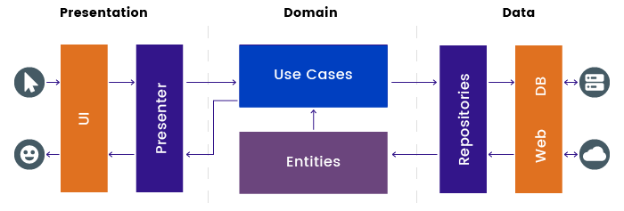

# TimesApp

## How I approached modularising the app ?

Separating core logic can help to create a clear separation of concerns that makes our code easier to understand so ,

i modularised the app to three types of module

1. “data” module.

    These typically contain a repository for accessing data remotely or via disk.

2. “presentation” module
   
    These contain the screens, view models,ui rendring , etc for a feature.  

3. “Domain” module

## Technical Notes:
1. Cacheing .
7. Follow most of `Google Design Guidelines`.
